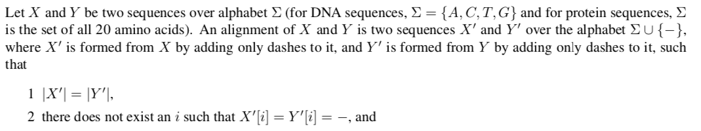
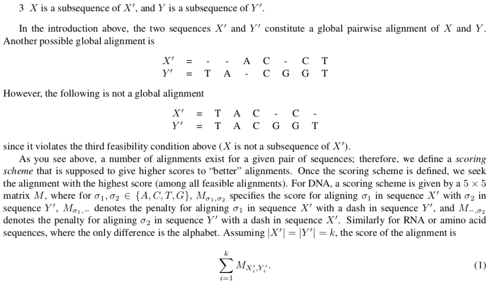
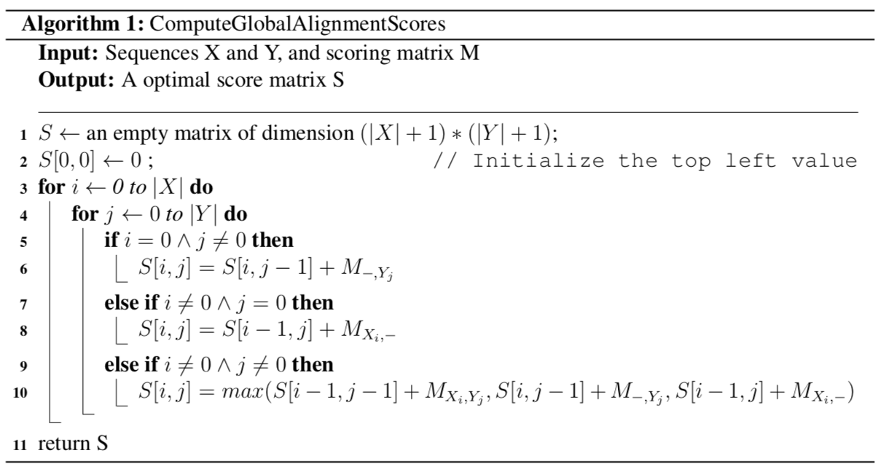

# Pairwise-Sequence-Alignment
A dynamic programming project. A complete explanation is provided in the [reading material](SequenceAlignment.pdf) by Dr.Luay Nakhleh.
The code of the global pairwise alignment and the local pairwise alignment are in [pairwise_alignment](pairwirse-alignment.py). The [analysis folder](/alignment-analysis) has additionally the application on real world genome data

## Global Pairwise Alignment :sunny: Feasibility & Optimality

:open_hands: Now its time to have a dynammic programming algorithm to compute the score of the optimal global scores. 

:open_hands::open_hands: Now for the algorithm to compute the global optimal alignment. 

